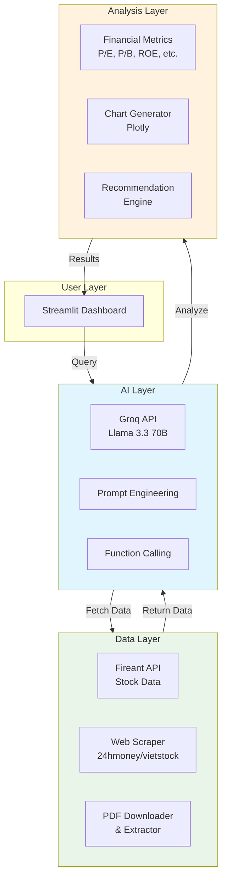

# AI Integration Plan for Streamlit Stock Dashboard

## 1. Overview

Tích hợp AI (LLM) vào dashboard Streamlit để:
1. **Phân tích & khuyến nghị đầu tư** từ dữ liệu dashboard hiện có
2. **Tìm & đọc báo cáo tài chính** từ 24hmoney/vietstock
3. **Tính toán chỉ số, vẽ biểu đồ**, đưa ra khuyến nghị

## 2. Architecture



## 3. Technology Stack

| Component | Technology | Reason |
|-----------|------------|--------|
| **LLM Provider** | Groq API (free tier) | Nhanh, miễn phí, tốt cho finance |
| **Model** | Llama 3.3 70B | Mạnh, reasoning tốt |
| **PDF Extraction** | pdfplumber + PyMuPDF | Đọc tốt tiếng Việt |
| **Web Scraping** | BeautifulSoup + requests | Lấy link PDF từ 24hmoney/vietstock |
| **Charting** | Plotly (có sẵn) | Tích hợp với dashboard |
| **Local Backup** | Ollama (optional) | Chạy offline khi cần |

## 4. Implementation Steps

### Phase 1: Infrastructure (3-4 tasks)
- [ ] Tạo module `ai_core/` với Groq integration
- [ ] Tạo class `FinancialReportFetcher` - scrape + download PDF
- [ ] Tạo class `PDFExtractor` - trích xuất text từ PDF
- [ ] Cấu hình Groq API key trong .env

### Phase 2: AI Chat Interface (2-3 tasks)
- [ ] Tạo UI chat với Streamlit (chat_message, session state)
- [ ] Implement system prompt cho finance analyst
- [ ] Xử lý multi-turn conversation

### Phase 3: Financial Report Analysis (4-5 tasks)
- [ ] Tìm và parse danh sách báo cáo từ 24hmoney.vn
- [ ] Tìm và parse danh sách báo cáo từ vietstock.vn
- [ ] Download PDF (xử lý zip nếu cần)
- [ ] Extract text: Báo cáo kết quả KD, Bảng CĐKT, Báo cáo lưu chuyển tiền tệ
- [ ] Parse số liệu từ text (revenue, profit, EPS, BV, etc.)

### Phase 4: Metrics & Charts (3-4 tasks)
- [ ] Tính toán chỉ số tài chính từ dữ liệu extracted
- [ ] Tạo hàm vẽ biểu đồ so sánh (revenue, profit growth)
- [ ] Tạo chart các chỉ số P/E, P/B qua các quý
- [ ] Tích hợp charts vào AI response

### Phase 5: Investment Recommendations (2-3 tasks)
- [ ] Tạo prompt template cho recommendation
- [ ] Implement risk assessment (dựa trên các chỉ số)
- [ ] Tạo output format: Buy/Hold/Sell với reasoning

### Phase 6: Tools & Function Calling (3-4 tasks)
- [ ] Định nghĩa tools: get_stock_price, get_financial_report, calculate_metrics
- [ ] Implement function calling với Groq
- [ ] Streamlit UI cho tool selection
- [ ] Handle errors gracefully

## 5. File Structure Mới

```
streamlit/
├── ai_core/
│   ├── __init__.py
│   ├── groq_client.py       # Groq API wrapper
│   ├── prompts.py           # System prompts, templates
│   └── tools.py             # Function definitions
├── financial_report/
│   ├── __init__.py
│   ├── scraper.py           # 24hmoney/vietstock scraper
│   ├── downloader.py        # PDF/Zip downloader
│   └── extractor.py          # PDF text extraction
├── analysis/
│   ├── __init__.py
│   ├── metrics.py            # Financial metrics calculation
│   ├── charts.py             # Chart generation
│   └── recommender.py        # Investment recommendation
├── dashboard-streamlit.py    # Updated với AI tab
└── requirements.txt          # Thêm: groq, pdfplumber, beautifulsoup4
```

## 6. Key Considerations

### Performance
- Groq API: ~100-200 tokens/second (rất nhanh)
- Free tier: rate limits cần handle
- Cache financial reports để không download lại

### Vietnamese Language
- Model Llama 3.3 hỗ trợ tốt tiếng Việt
- Prompt nên là tiếng Việt để output đúng ngôn ngữ

### PDF Complexity
- Báo cáo tài chính VN thường có format phức tạp
- Cần handle: bảng merge cells, số âm trong ngoặc đơn, nhiều sheet
- Fallback: gửi raw text cho AI parse nếu pdfplumber không tốt

## 7. Example Use Cases

### Use Case 1: Phân tích cổ phiếu đang xem
```
User: "Phân tích HPG"
AI: 
1. Lấy dữ liệu giá từ Fireant
2. Tính P/E, P/B, ROE
3. So sánh với ngành
4. Khuyến nghị: Mua/Ngắm/Tránh
```

### Use Case 2: Đọc báo cáo tài chính
```
User: "Lấy báo cáo tài chính quý 4/2024 của HPG"
AI:
1. Scrape 24hmoney.vn tìm link PDF
2. Download và extract text
3. Parse số liệu: doanh thu, lợi nhuận, EPS
4. Tính growth so với quý trước
5. Vẽ biểu đồ revenue trend
```

### Use Case 3: So sánh công ty
```
User: "So sánh HPG vs HSG"
AI:
1. Lấy dữ liệu cả 2 mã
2. So sánh P/E, P/B, ROE, biên lợi nhuận
3. Vẽ biểu đồ so sánh
4. Đưa ra khuyến nghị dựa trên metrics
```

## 8. Next Steps

1. **Xác nhận plan** - User approve
2. **Setup Groq API** - Lấy API key
3. **Bắt đầu Phase 1** - Tạo infrastructure
4. **Iterate** - Test từng component

---

*Plan created: 2026-03-22*
